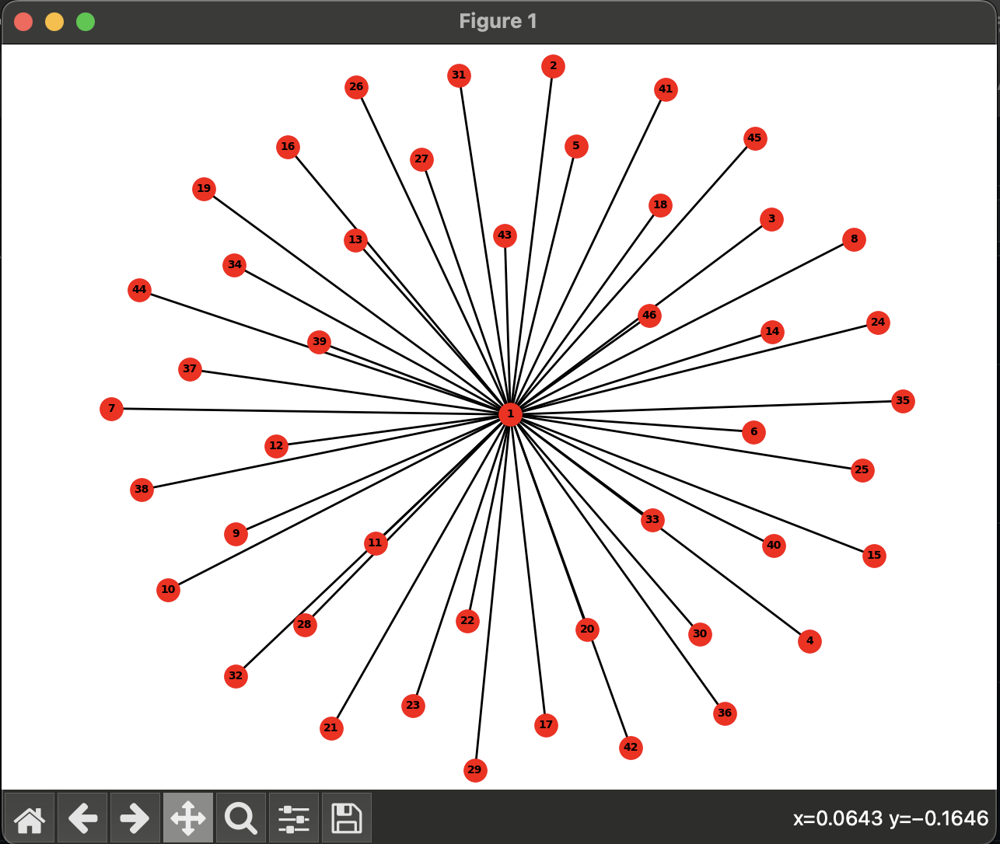

# Web Crawler
A web crawler application that creates a web-link graphs and finds the Closeness Centrality for each node

## Introduction	
This program is a web crawler designed to extract URLs from web pages and create a graph representation of the web structure. The main purpose of the project is to analyze the connectivity of web pages and identify central nodes within the network. This can be useful for various applications such as understanding website structures, search engine optimization, and network analysis.

## Description
The program utilizes Python and various libraries including requests, BeautifulSoup, networkx, and matplotlib. It begins by prompting the user to specify the maximum depth of the web crawling process. It then reads a list of URLs from a text file, extracts links from each URL up to the specified depth, and constructs a graph where nodes represent URLs and edges represent connections between them. The program employs Dijkstra's algorithm to compute shortest paths from a chosen source node, enabling the calculation of closeness centrality for each node. Finally, it visualizes the graph and saves the results including node closeness and URL mappings to CSV files.

## Requirements	
Python 3.x
Libraries: requests, BeautifulSoup, networkx, matplotlib

## User Manual
1. Ensure you have Python installed on your system
2. Prepare a textfile containing a list of URLs you wan to web-crawl. Each URL should be on a separate line.
3. Place this file inside the "list" directory
4. Change the file name to
``urls.txt``
This is to keep the command short and simple
5. Navigate to the root directory of this program
6. Run your virutal environment with
``source venv/bin/activate``
7. Install the required libraries using:
``pip3 install -r requirements.txt``
8. Run
``python3 main.py``
9. Input your desired web-crawling depth
10. Input this directory for to web-crawl your prepared textfile 
``list/urls.txt``
## Reflection
Web Crawling (DFS):
The web crawling algorithm employs depth-first search (DFS) to traverse the web graph.
The time complexity of DFS is O(V + E), where V is the number of vertices (nodes) and E is the number of edges in the graph.
In this case, V represents the number of URLs visited, and E represents the number of hrefs found on each URL.

Dijkstra's Algorithm:
Dijkstra's algorithm is used to compute shortest paths from a source node to all other nodes in the graph.
The time complexity of Dijkstra's algorithm using a binary heap is O((V + E) * log(V)), where V is the number of vertices and E is the number of edges.
In your case, V represents the number of nodes in the graph, and E represents the number of edges.

Overall Time Complexity:
The overall time complexity of this program is primarly based off the web crawling algorithm and the Dijkstra's algorithm.
Assuming the graph is sparse (E is proportional to V), the dominant factor in time complexity would likely be the Dijkstra's algorithm, which is O((V + E) * log(V)).

Collaborating on a project, especially one with diverse requirements like web crawling and graph analysis, often leads to unexpected challenges and learning opportunities. In our case, integrating unfamiliar libraries such as SciPy was necessary to ensure the functionality of the program. Despite not fully understanding their inner workings, we found ways to incorporate them effectively. Moreover, when implementing features like a menu option, we encountered scope issues, prompting us to opt for a more straightforward approach to maintain clarity and ease of use.

Working collaboratively on a relatively small project presented its own set of hurdles, but we navigated them by dividing tasks and taking turns building specific components. This approach allowed us to leverage each other's strengths and expertise while ensuring a cohesive end product. Ultimately, overcoming these challenges fostered a deeper understanding of the project as a whole and enhanced our problem-solving skills in a collaborative environment.

## Results

